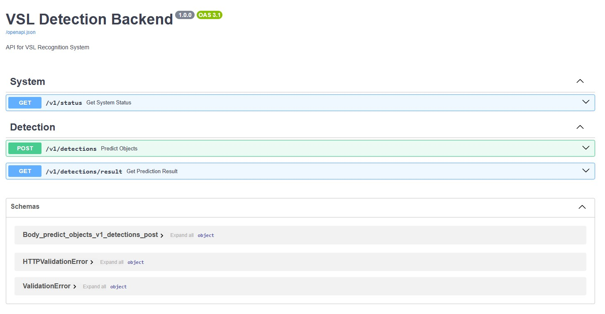
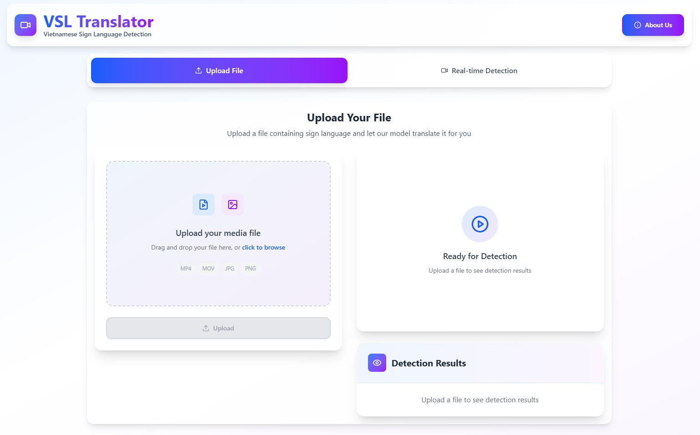

# Sign language translation model for Vietnamese

A web application for Vietnamese Sign Language detection and recognition using trained YOLO models. The system provides both file-upload and real-time detection capabilities through a user-friendly web interface.

## Overview

This project consists of two main components:

- **Backend (FastAPI)**: YOLO-based sign language detection service with REST API and WebSocket support
- **Frontend (React + TypeScript)**: Modern web interface for both file upload and real-time video detection

## Features

- **Sign Language Detection**: Detect and recognize Vietnamese sign language gestures in images and videos
- **Real-time Detection**: Process webcam video for instant sign language recognition
- **File Upload Processing**: Upload and process image/video files for batch detection
- **Paraphrasing Service**: Convert detected sign language to natural language text
- **WebSocket Support**: Real-time communication for low-latency video processing

## Project Structure

```
vsld-project/
├── vsld-backend/             # FastAPI backend application
│   ├── app/                  # Main application package
│   │   ├── api/              # API endpoints and routes
│   │   ├── core/             # Core configuration
│   │   ├── services/         # Logic services
│   │   └── utils/            # Utility functions
│   ├── fonts/                # Text fonts
│   ├── models/               # YOLO model files
│   ├── requirements.txt      # Python dependencies
│   └── run.py                # Application entry point
│
└── vsld-frontend/            # React+TypeScript frontend
    ├── src/                  # Source code
    │   ├── api/              # API client services
    │   ├── components/       # React components
    |   ├── hooks/            # Custom hooks
    │   ├── pages/            # Pages
    │   └── types/            # TypeScript type definitions
    ├── public/               # Static assets
    └── package.json          # NPM dependencies
```

## Getting Started

### Backend Setup

1. Navigate to the backend directory:
   ```bash
   cd vsld-backend
   ```

2. Create and activate a virtual environment:
   ```bash
   python -m venv .venv
   .\.venv\Scripts\activate
   ```

3. Install dependencies:
   ```bash
   pip install -r requirements.txt
   ```

4. Run the FastAPI server:
   ```bash
   python run.py
   ```

The backend will start at `http://localhost:8000` by default.

The API Document created by [SwaggerUI](https://swagger.io/tools/swagger-ui/) can be access at `http://localhost:8000/docs`.


### Frontend Setup

1. Navigate to the frontend directory:
   ```bash
   cd vsld-frontend
   ```

2. Install dependencies:
   ```bash
   npm install
   ```

3. Start the development server:
   ```bash
   npm run dev
   ```

The frontend will be available at `http://localhost:5173`.
This is the UI when start the client.


## System Requirements

### Backend
- Python 3.12+
- CUDA-compatible GPU (recommended for optimal performance)
- 4GB+ RAM

### Frontend
- Node.js 18+
- Modern web browser with WebSocket support

## Technologies Used

### Backend
- FastAPI - Web framework for building APIs
- Ultralytics YOLO11 - Object detection model
- OpenCV - Computer vision processing
- WebSockets - Real-time communication

### Frontend
- React 19
- TypeScript
- Vite - Build tool and development server
- Tailwind CSS - CSS framework

## Application Workflow

1. **File Upload Mode**:
   - User uploads an image or video file
   - Backend processes the file using the YOLO model
   - Results are returned showing detected sign language with bounding boxes
   - Paraphrasing service converts the array of detected signs to natural language

2. **Real-time Detection Mode**:
   - User enables webcam access
   - Video frames are sent to backend via WebSocket
   - Real-time detection results are streamed back to the frontend
   - Detected signs are displayed with visual indicators and text output

## License

MIT License

## Acknowledgements

This project was developed as part of my thesis at International University, VNU-HCM, Vietnam focusing on assistive technology for the hearing impaired through computer vision and deep learning techniques. Give this repo a star if this is useful for you!
