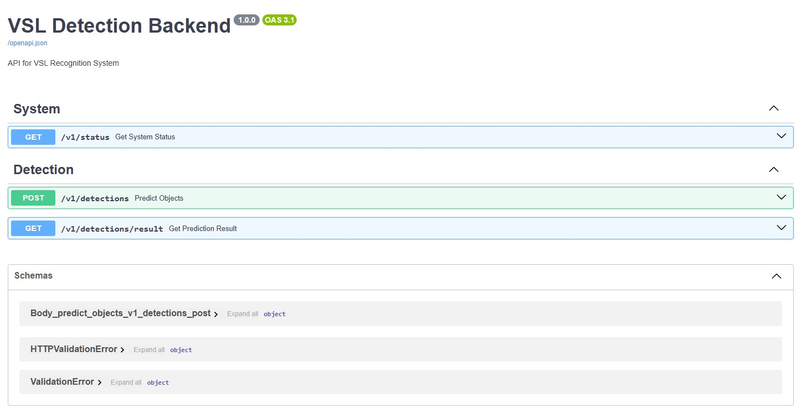
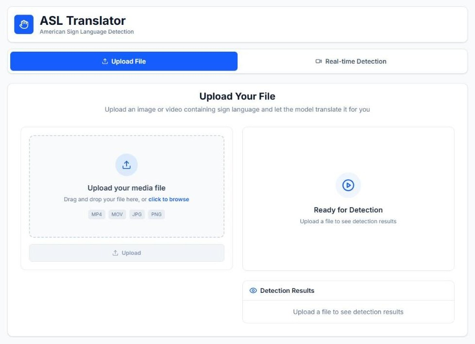

# ASL Translator — American Sign Language Detection

A web application that detects and recognises American Sign Language (ASL) signs in images, videos and a live
webcam feed using a YOLO11 detection model, and turns the signs in a video into an English sentence. A FastAPI
backend runs the models; a React + TypeScript frontend provides file upload and real-time detection.

**Thesis Report**: [Sign Language Translation Model](./ITCSIU21112_NguyenDucToan.pdf)

**Thesis Demo**: [Demo Video](./ITCSIU21112_NguyenDucToan.mp4)

## Overview

- **Backend (FastAPI)**: loads a YOLO11 model (ONNX by default), exposes a REST API for file detection with
  background jobs and progress tracking, and a WebSocket endpoint for real-time detection.
- **Frontend (React + TypeScript + Tailwind CSS)**: upload images/videos and review the annotated result, or run
  live detection from the webcam with bounding boxes drawn over the video.

## Features

- **Sign detection** in images (`.jpg`, `.jpeg`, `.png`) and videos (`.mp4`, `.mov`)
- **Real upload and processing progress**: byte-level upload progress, then per-frame processing progress polled
  from the backend job
- **Frame-synced video results**: the detection panel follows the video playhead frame by frame; the annotated
  result video supports seeking
- **Sign sequence for videos**: per-frame detections are merged into an ordered list of signs (flickers and
  very short detections removed); click a sign to jump to it in the video
- **Sentence translation for videos**: a fine-tuned T5 model turns the sign sequence into English, adding the
  missing words and word order (`Your, Name, What` → "What is your name?"); see [training/](training/README.md)
- **Real-time detection** over WebSocket with client-side bounding-box overlay, live FPS and latency readout
- **22 supported signs**: Call, Deaf, Doctor, Drink, Eat, Hello, Help, House, How, I, I love you, My, Name, No,
  Pain, Thank you, Thirsty, What, Where, Yes, You, Your

## Project Structure

```
VSL-Detection/
├── backend/                  # FastAPI backend application
│   ├── app/
│   │   ├── api/routes/       # REST (detection, system) and WebSocket routes
│   │   ├── config/           # Paths, thresholds, CORS, model selection
│   │   ├── services/         # Detector, job manager, video conversion,
│   │   │                     # sign segmentation, sentence generation
│   │   └── utils/            # File helpers
│   ├── fonts/                # Font used for labels on annotated frames
│   ├── models/               # YOLO model files and gloss2text/ (sentence model)
│   ├── requirements.txt      # Python dependencies
│   └── run.py                # Application entry point
│
├── training/                 # Sentence model: datasets, Colab notebook, evaluation
│
└── frontend/                 # React + TypeScript frontend
    ├── src/
    │   ├── api/              # HTTP and WebSocket clients
    │   ├── components/       # Upload, Realtime and shared UI components
    │   ├── hooks/            # useFileUpload, useWebcam, useRealtimeDetection
    │   ├── pages/            # Tab pages
    │   └── types/            # TypeScript type definitions
    ├── public/               # Static assets
    └── package.json          # NPM dependencies
```

## Setup Instructions

### Clone the Repository

```bash
git clone https://github.com/duwcston/VSL-Detection.git
cd VSL-Detection
git checkout ASL
```

### Backend Setup

1. Navigate to the backend directory:

    ```bash
    cd backend
    ```

2. Create and activate a virtual environment:

    ```bash
    python -m venv .venv
    # Windows
    .\.venv\Scripts\activate
    # macOS / Linux
    source .venv/bin/activate
    ```

3. Install dependencies:

    ```bash
    pip install -r requirements.txt
    ```

4. Make sure the model file exists at `backend/models/` (change `DEFAULT_MODEL_PATH` in
   `app/config/config.py` to use another model).

5. Optional: install the sentence model in `backend/models/gloss2text/` (train it with
   `training/train_gloss2text.ipynb`, see [training/README.md](training/README.md)). Without it, videos show the
   sign sequence but no translated sentence.

6. Run the FastAPI server:

    ```bash
    python run.py
    ```

The backend starts at `http://localhost:8000`. The model is loaded and warmed up once at startup, so the first
request is not slowed down. A CUDA GPU is used automatically when available.

The API documentation generated by [Swagger UI](https://swagger.io/tools/swagger-ui/) is available at
`http://localhost:8000/docs`. 

### Frontend Setup

1. Navigate to the frontend directory:

    ```bash
    cd frontend
    ```

2. Create a `.env` file pointing at the backend:

    ```bash
    VITE_BACKEND_URL=http://localhost:8000
    ```

3. Install dependencies:

    ```bash
    npm install
    ```

4. Start the development server:

    ```bash
    npm run dev
    ```

The frontend is available at `http://localhost:5173` (the only origin allowed by the backend's CORS settings by
default). 

## API

| Method | Endpoint                          | Description                                                                |
|--------|-----------------------------------|----------------------------------------------------------------------------|
| GET    | `/v1/status`                      | Health check                                                               |
| POST   | `/v1/detections`                  | Upload an image/video (`multipart/form-data`, field `file`); returns `job_id` |
| GET    | `/v1/detections/{job_id}/progress`| Job status (`pending`/`processing`/`done`/`error`), progress 0–100 and result |
| GET    | `/v1/detections/result`           | Annotated image or MP4 video of the latest job (supports HTTP Range requests) |
| WS     | `/v1/detections/stream`           | Real-time detection on webcam frames                                       |

For videos, the job `result` contains per-frame `detections`, `fps`, the merged sign sequence `glosses`
(`label`, `start`/`end` in seconds, mean `confidence`) and the generated `sentence` (`null` when no sentence
model is installed).

**WebSocket protocol** — send one JSON message per frame and wait for its reply before sending the next:

```json
{ "image": "data:image/jpeg;base64,...", "timestamp": 1712345678901, "return_image": false }
```

The server replies with:

```json
{
  "timestamp": 1712345678901,
  "detections": [{ "class_name": "Hello", "confidence": 0.93, "bbox": [x1, y1, x2, y2] }],
  "frame_size": [320, 240]
}
```

`bbox` is in the pixel coordinates of the frame that was sent (`frame_size` = `[width, height]`). Set
`return_image: true` to also receive an annotated JPEG in `image`. Frames that arrive while a previous frame is
still being processed are dropped so results stay real-time.

## Application Workflow

1. **File Upload Mode**
    - The user selects or drops an image/video and clicks **Upload**
    - The file is streamed to the backend, which starts a background job and returns a `job_id`
    - The frontend polls the job's progress while YOLO processes the file (videos frame by frame)
    - Videos are transcoded to H.264 MP4 with ffmpeg for in-browser playback
    - The annotated result is shown with the detected signs and their confidence; for videos, the list follows
      the current frame
    - For videos, consecutive detections are merged into a sign sequence (signs under 0.3 s are dropped, gaps
      up to 0.25 s are bridged), and the sentence model translates it into an English sentence

2. **Real-time Detection Mode**
    - The webcam starts when the tab is opened and stops when leaving it
    - On **Start**, frames are downscaled to the model's 320 px input, JPEG-encoded and sent over WebSocket
    - The next frame is sent as soon as the previous result arrives (capped at 15 FPS), so throughput follows the
      backend's speed without queueing stale frames
    - Bounding boxes are drawn in the browser on top of the live video, and the detected sign, FPS and latency are
      shown beside it

## Performance Notes

- The real-time path uses a 320×320 input (the model's training size) and `max_det=1`
- Annotated images are not sent back in real-time mode by default; drawing happens client-side
- Video results are transcoded with ffmpeg (`veryfast` preset, `+faststart`) instead of decoding frames in Python
- Uploads are written to disk in chunks rather than loaded fully into memory
- The frontend uses plain CSS transitions (no animation library) and honours `prefers-reduced-motion`

## System Requirements

### Backend

- Python 3.12+
- CUDA-compatible GPU (optional, recommended for real-time use)
- 4GB+ RAM

### Frontend

- Node.js 18+
- A modern browser with WebSocket and webcam (`getUserMedia`) support

## Technologies Used

### Backend

- FastAPI — web framework for the REST and WebSocket APIs
- Ultralytics YOLO11 + ONNX Runtime — object detection
- OpenCV and Pillow — image processing and annotation
- ffmpeg (via `imageio-ffmpeg`) — video transcoding
- Hugging Face Transformers (Flan-T5) — sign sequence to sentence, trained on ASLG-PC12 + in-domain phrases

### Frontend

- React 19 + TypeScript
- Vite — build tool and development server
- Tailwind CSS 4 — styling
- Axios — HTTP client
- Lucide — icons

## Known Limitations

- Annotated output is stored in a single `runs/detect/predict` folder, so the backend handles one file upload
  at a time
- Sentences can only use the 22 recognised signs; words outside the vocabulary (e.g. fingerspelled names) are
  missing, so the raw sign sequence is always shown next to the sentence
- Sentence generation runs on uploaded videos only, not in the real-time tab

## License

MIT License

## Acknowledgements

This project was developed as part of my thesis at International University, VNU-HCM, Vietnam, focusing on
assistive technology for the hearing impaired through computer vision and deep learning.
